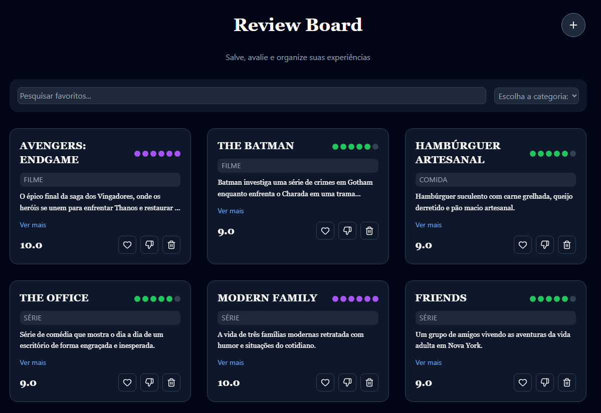

# 📌 Review Board

Uma aplicação em React para salvar, avaliar e organizar favoritos pessoais. O usuário pode adicionar itens, atribuir notas, categorizar conteúdos e filtrar/pesquisar sua lista.

---

## ✨ Funcionalidades

- ➕ Adicionar favoritos  
- ⭐ Sistema de notas (0 a 5)  
- ❤️ Like / 👎 Dislike  
- 🗂️ Filtro por categoria  
- 🔎 Busca por título  
- 💾 Persistência com LocalStorage  
- 🎞️ Animações de entrada e saída (fade-in / fade-out)  
- 📱 Interface responsiva  

---

## 🛠️ Tecnologias

- React  
- JavaScript  
- Tailwind CSS  
- Lucide Icons  
- LocalStorage  
- Vite  

---

## 🎨 Destaques de UI/UX

- Design dark moderno  
- Cards com animações suaves  
- Hover effects e microinterações  
- Layout responsivo (mobile-first)  
- Transições fluidas entre ações  

---

## 🚀 Como rodar o projeto

```bash
git clone https://github.com/BrunaBeatriiz/review-board.git
cd review-board
npm install
npm run dev
```

---

## 📸 Preview



---

## 🌐 Deploy

👉 https://SEU-LINK.vercel.app

---